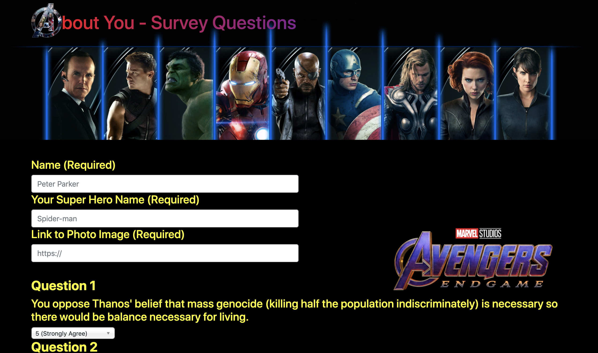

# Avengers-Soulmate-Match
Avengers Super heroes Soulmate Finder: Full-Stack Site using Node and Express Servers

## Overview
Marvel Cinematic Universe super heroes are powerful defenders of all things good. They could even be our soulmates.  In honor of Marvel Studios’ Avengers: Endgame with a record-breaking opening in theaters this week (on 4/22/2019), you might be wondering which super hero is right for you. You’re about to find out! This full- stack site will take in your results from the 10-question survey, then compare their answers with those from one of the Avengers Super Heroes or other "Super" Users. The app will then display the name and picture of the Super Hero or "Super" User with the best overall match.

This full-stack application incorporates both front-end and back-end languages and frameworks, as well as in server, network and hosting environments. Express.js, a server framework for Node.js, is used to handle routing.  To run the server codes, the app is deployed live on Heroku. Make sure you turn on your sound to hear the text-to-speech selection of your soulmate.

## Built with:
* HTML5
* CSS3
* JavaScript
* jQuery
* Node.js
* Node Package Manager (npm)
* Chosen (http://harvesthq.github.io/chosen/) - jQuery plugin/library for making long, unwieldy select boxes more friendly. 

## npm packages: 
* [Express] (https://www.npmjs.com/package/express) - Fast, unopinionated, minimalist web framework for node to handle routing.
* [GoogleTTS] (https://www.npmjs.com/package/google-tts-api) - Google TTS (Text-To-Speech) for node.js provides audio synthesis of text.

## Author
* Eddie Chiang
* Click on the deployed app on Heroku!
https://vast-peak-24032.herokuapp.com/
* Click on the GitHub link to view code!
https://github.com/echiang73/Avengers-Soulmate-Match

## Here is the preview of the web application:

